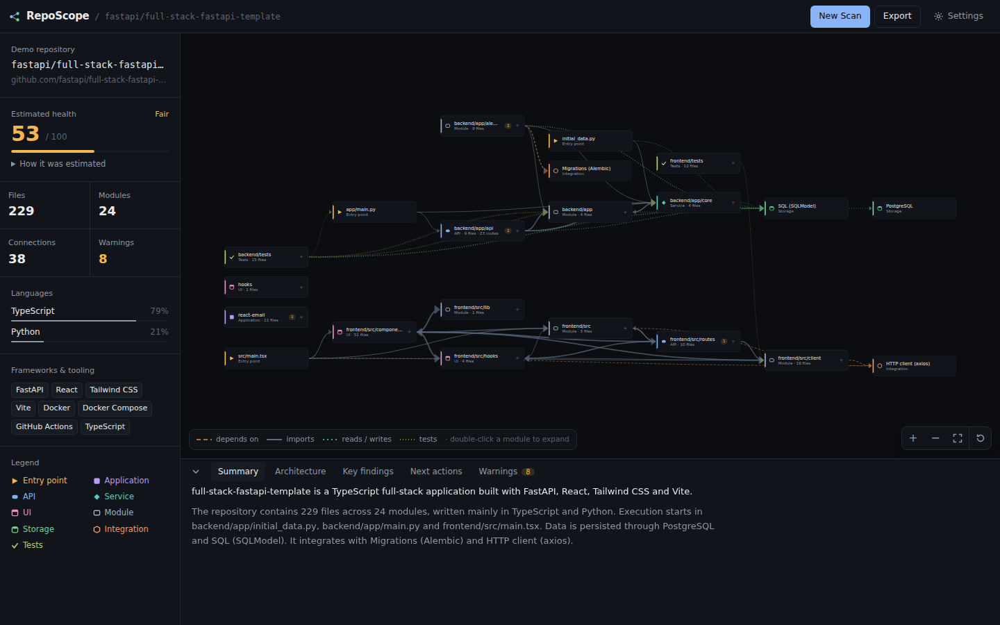
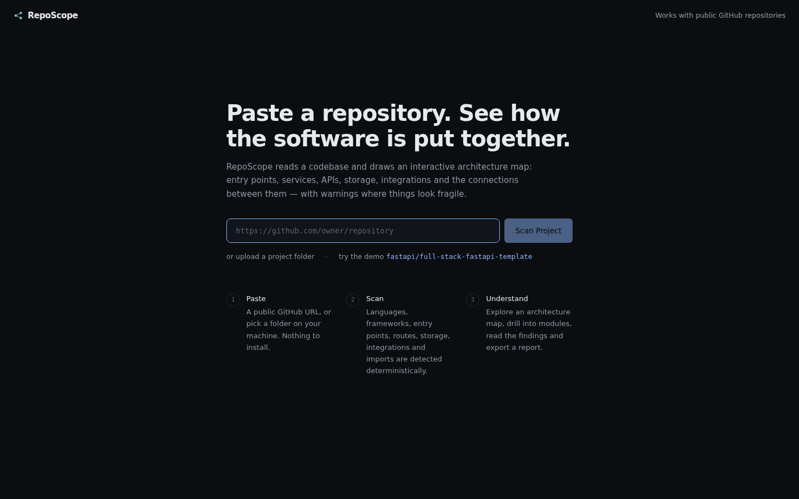
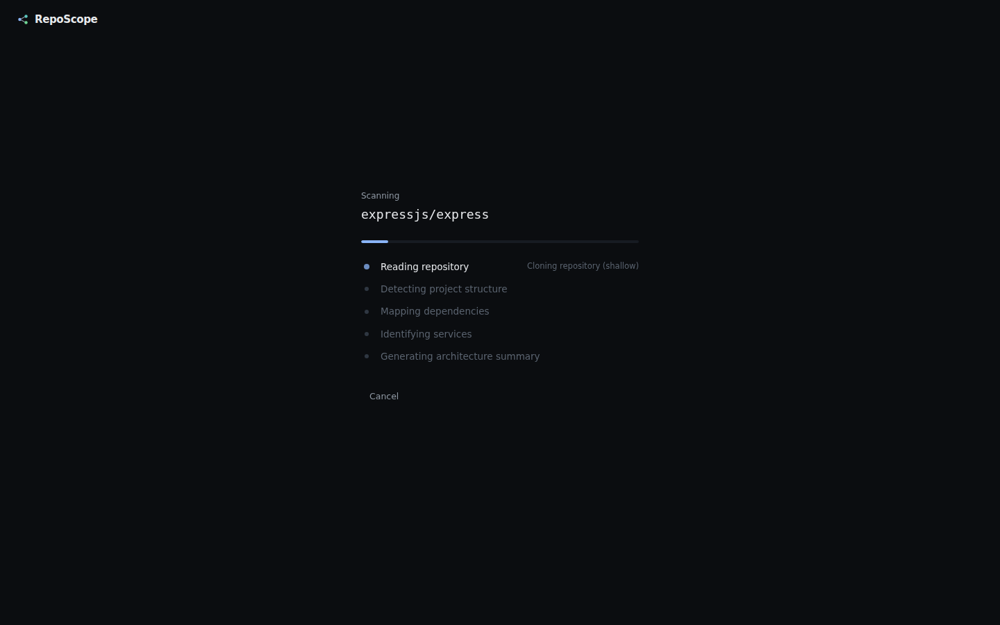
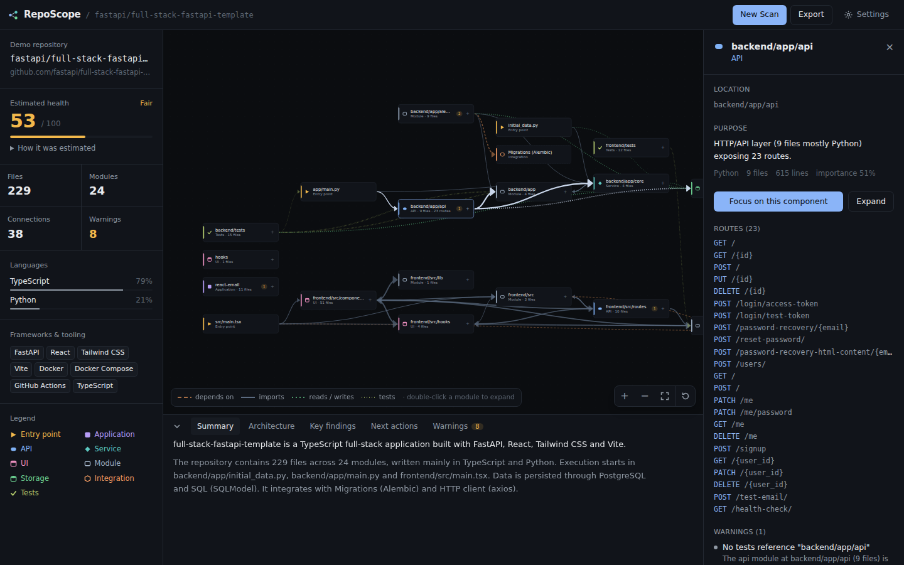
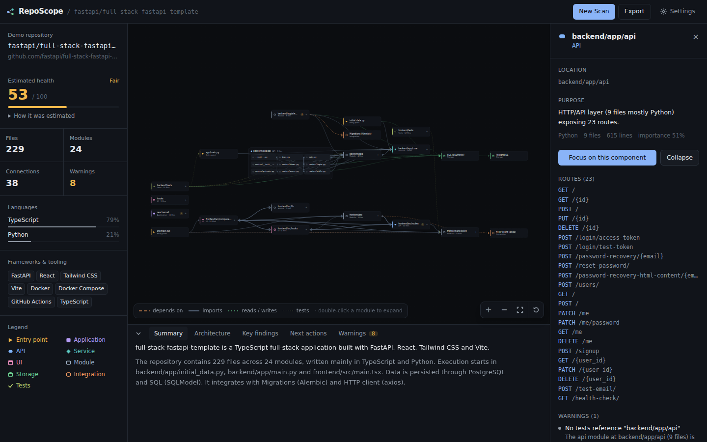

<p align="center">
  
</p>

<h1 align="center">RepoScope</h1>

<p align="center">
  Paste a repository. Scan it. Immediately understand how the software is put together.
</p>

<p align="center">
  <a href="https://github.com/Formicaria/RepoScope/actions/workflows/ci.yml"></a>
  <a href="LICENSE"></a>
  
  <a href="ROADMAP.md"></a>
</p>

---

RepoScope reads a public GitHub repository (or a folder from your machine), detects its languages, frameworks, entry points, API routes, services, storage layers and external integrations, resolves the import graph, and draws an **interactive architecture map** — with warnings where things look fragile, an estimated health score, key findings, and one-click exports.

Analysis is **deterministic**: no LLM is needed. An optional OpenAI-compatible provider (Ollama works) can polish the summary prose, and nothing else.

## Quick start

Requires **Node.js 20+** and `git` on your `PATH` (used for shallow clones).

```bash
git clone https://github.com/Formicaria/RepoScope.git
cd RepoScope
npm install
npm run dev
```

Open <http://localhost:5173>, paste a repository URL such as `https://github.com/fastapi/full-stack-fastapi-template`, and click **Scan Project**. Or click **try the demo** to load the bundled sample scan without touching the network.

Production build (one process serving the client and the API on port 8787):

```bash
npm run build
npm start
```

## What you get

<table>
<tr>
<td width="50%"></td>
<td width="50%"></td>
</tr>
<tr>
<td></td>
<td></td>
</tr>
</table>

- **Architecture map, not a folder tree.** Nodes are entry points, apps, APIs, services, UI layers, modules, storage and external integrations. Edges are imports, data flow, dependencies and test coverage. Colour and shape encode type; edge weight encodes how many files talk to each other.
- **High-level first, detail on demand.** Files are grouped into modules; double-click (or press _Expand_) to reveal a module's files. _Focus_ dims everything except a component's neighbourhood. _Reset_ puts it all back.
- **Inspector.** Click any node for its purpose, location, detected routes, dependencies, dependents, files and warnings.
- **Analysis panel.** Project summary, architecture explanation, key findings, recommended next actions and the full warning list.
- **Warnings** for unclear entry points, dead-looking modules, missing tests, duplicate functionality, excessive complexity, circular imports, exposed secrets, very large files and unused dependencies.
- **Estimated health score** (0–100) from measurable signals, with the breakdown shown. It is labelled an estimate because that is what it is.
- **Exports.** JSON of the full data model, a Markdown architecture report (with a Mermaid diagram), and a read-only share link.
- **Folder upload** that reads files in your browser; `node_modules`, build output and `.git` never leave your machine, and secret files are listed by name only.

## Commands

| Command                                 | What it does                                                      |
| --------------------------------------- | ----------------------------------------------------------------- |
| `npm run dev`                           | API (`:8787`) + web app (`:5173`) with hot reload                 |
| `npm run build`                         | Build the client into `dist/`                                     |
| `npm start`                             | Serve `dist/` and the API on `PORT` (default 8787)                |
| `npm run check`                         | Prettier check + TypeScript + tests — what CI runs                |
| `npm test`                              | Vitest suite                                                      |
| `npm run typecheck`                     | `tsc` for client and server                                       |
| `npm run format`                        | Prettier write                                                    |
| `npm run scan:local -- ./some/repo`     | Analyse a folder from the terminal (`--json` for the full result) |
| `npm run demo:generate -- <github url>` | Regenerate `src/data/demo.json` from a real repository            |

## How it works

```
GitHub URL ──► shallow clone ──┐
                               ├──► ingest      ignore rules, size caps, secrets never read
Folder upload (browser) ───────┘        │
                                        ▼
                                     detect      languages · manifests & frameworks · entry points · routes · storage
                                        │
                                        ▼
                                     imports     per-language extraction + resolution (relative, tsconfig aliases, packages)
                                        │
                                        ▼
                                     graph       folders → typed modules · file-level edges · integration & storage nodes · importance
                                        │
                                        ▼
                                     warnings ──► health score ──► template summary ──► (optional LLM rewrite)
```

Every stage is a pure function over the previous stage's output, so the parser, graph builder, scoring and UI can evolve independently. See [docs/ARCHITECTURE.md](docs/ARCHITECTURE.md) for the data model, module layout and extension points.

### Supported languages

| Language                | Import resolution | How                                                                                                          |
| ----------------------- | ----------------- | ------------------------------------------------------------------------------------------------------------ |
| TypeScript / JavaScript | ✅                | relative paths, `tsconfig`/`jsconfig` `paths` (wildcards included), Vite aliases, `$lib`, workspace packages |
| Python                  | ✅                | absolute, relative and `from . import module`, any project root                                              |
| Go                      | ✅                | module-local packages, multi-module repositories                                                             |
| Rust                    | ✅                | `mod`, `crate::`, and sibling crates in a Cargo workspace                                                    |
| Java / Kotlin / Scala   | ✅                | resolved through the `package` each file declares                                                            |
| C#                      | ✅                | namespace-level `using`                                                                                      |
| Ruby, PHP, Dart, C/C++  | partial           | relative requires / includes, PHP namespaces                                                                 |
| Everything else         | counted           | grouped by folder, no edges                                                                                  |

Files are parsed with [tree-sitter](https://tree-sitter.github.io/) grammars, so multi-line import lists, `import type`, re-exports and dynamic imports are read correctly — and imports that only appear inside comments, strings or template literals are correctly _not_ read. The grammars are an optional dependency: install with `npm ci --omit=optional` (or let the install fail) and the analyzer falls back to regular expressions, with lower accuracy but no loss of function.

Route detection covers Express/Koa/Fastify/Hono, FastAPI/Flask, Next.js/SvelteKit/Nuxt file routes, Go `net/http`/gin/echo/chi/fiber, ASP.NET attributes, Spring, Rails `routes.rb`, Laravel and axum/actix. Storage detection covers the common ORMs and drivers across ecosystems plus `docker-compose` services and Prisma schemas. Found a gap? Open a [detection gap issue](.github/ISSUE_TEMPLATE/detection_gap.md).

### Accuracy

Analyzer changes are judged against a corpus of ten real public repositories rather than by intuition:

```bash
npm run bench            # scan the corpus, write benchmarks/snapshot.json
npm run bench -- --diff  # scan and print the delta against the committed snapshot
```

The headline metric is the **unresolved-local rate**: the share of import specifiers that unambiguously point inside the repository (relative paths, configured aliases, workspace packages) but could not be resolved to a file. Those are always analyzer gaps, which makes the number ground truth that needs no hand labelling. It currently sits at **0.6%** across the corpus, down from 3.4% on regular expressions alone. See [benchmarks/README.md](benchmarks/README.md).

### Optional LLM summary

Copy `.env.example` to `.env` and set:

```bash
REPOSCOPE_LLM_URL=http://localhost:11434/v1   # any OpenAI-compatible endpoint, e.g. Ollama
REPOSCOPE_LLM_MODEL=llama3.1
REPOSCOPE_LLM_API_KEY=                        # optional
```

The model only rewrites the three prose fields of the summary. Nodes, edges, warnings and the score are never generated by it, and any failure falls back to the template output.

## Privacy and secrets

- Secret-carrying files (`.env*`, `*.pem`, `*.key`, `credentials.json`, …) are recorded by name and **never read, stored or displayed**.
- Secret patterns found inside source files are reported by file and line only; the matched value is never included in the result, the exports or the UI.
- Clones are shallow, live in a temp directory, and are deleted as soon as analysis finishes.
- Scan results are kept in the API's memory only. There are no accounts and nothing is written to disk.

## Limitations (MVP)

- Private repositories are not supported yet — upload the folder instead. See the [roadmap](ROADMAP.md).
- Module types come from folder names and contents; "unused dependency" and "dead module" are best-effort; dynamic imports and plugins are invisible.
- Repositories above ~400 MB (as reported by GitHub) or 6,000 analysable files are refused or truncated.
- Share links only work while the server process that produced them is running.

## Contributing

Bug reports, detection gaps and pull requests are welcome. Read [CONTRIBUTING.md](CONTRIBUTING.md) for the development workflow and how to add a framework, route pattern or warning. The [roadmap](ROADMAP.md) lists what's planned and where help is most useful.

## License

[MIT](LICENSE) © Formicaria
